# 🚀 LinkedIn Keynote Drafts for MindTab

Here are three variations for your LinkedIn post. Choose the one that best fits your voice, or mix and match!

---

## Option 1: The "Storyteller" (High Engagement) 📖
*Best for: Connecting with a broad audience and highlighting the "Why".*

**Headline: I finally fixed my browser tab chaos. And I used Hybrid AI to do it.**

We've all been there. It starts with one "quick research" session.
Two hours later: 50 open tabs. 
The fan on my laptop is screaming. 
And I’ve completely forgotten why I opened half of them. 🤯

I realized this wasn't just a clutter problem. It was a cognitive load problem.
So I built a solution.

Meet **MindTab** 🧠✨
A privacy-first Chrome Extension that gives you the best of both worlds:
1.  **Local AI (Gemini Nano)**: Private, fast, and free. Runs 100% on your device.
2.  **Cloud APIs**: Plug in your OpenAI or DeepSeek keys for massive reasoning power when you need it.

With one click, it reads your open tabs and intelligently groups them by topic. "Research", "Shopping", "Dev Work"—sorted instantly.

Usage is simple:
1. Open the sidebar.
2. Chat with your browser ("Group my tabs", "Summarize this page").
3. Reclaim your focus.

It's open source, it's in Beta (v0.1), and I'd love for you to break it. ⚒️

**👉 Try it out & Star the Repo:** https://github.com/csa7mdm/mindtab

I'm looking for feedback, bug reports, and contributors. Let me know what you think!

#OpenSource #AI #LocalLLM #GeminiNano #React #Productivity #IndieDev

---

## Option 2: The "Tech Leader" (Professional & Concise) 💼
*Best for: Showcasing technical innovation and privacy focus.*

**Headline: Bringing Hybrid AI to the Browser 🔒⚡**

I’m excited to share **MindTab**, an open-source productivity tool I’ve been engineering.

The goal was simple: Build an intelligent tab manager that empowers the user, not the cloud.
MindTab features a **Dual-Engine Architecture**:

🔹 **Default**: Uses **Gemini Nano** (Chrome's built-in model) for default commands.
   *   ✅ Zero latency
   *   ✅ Zero data egress
   *   ✅ 100% Free

🔹 **Power Mode**: Supports **BYOK (Bring Your Own Key)** for OpenAI/DeepSeek.
   *   ✅ Access giant context windows
   *   ✅ Use SOTA reasoning models

**Key Features:**
*   **Context-Aware Grouping**: automatically clusters tabs by semantic similarity.
*   **RAG-powered Chat**: Ask questions about your active tab's content.
*   **Modern Stack**: Built with React 19, TypeScript, and Zustand.

We are currently in **Beta v0.1**. If you are a developer or power user interested in the future of on-device AI, I invite you to test it out.

**Code & Documentation:** https://github.com/csa7mdm/mindtab

Contributions are highly welcome—PRs open!

#WebDevelopment #ChromeExtension #Privacy #ArtificialIntelligence #SoftwareEngineering

---

## 📸 Visual Assets for your Post

**1. Conceptual Architecture**
*(Attach the image generated below)*

**2. System Diagram (Mermaid)**
*You can take a screenshot of this diagram to show the technical flow:*

```mermaid
graph LR
    User[User] --> Extension[MindTab Extension]
    
    subgraph "Hybrid AI Engine"
        Extension -->|Default & Private| Local[⚡ Local Gemini Nano]
        Extension -->|Optional & Powerful| Cloud[☁️ OpenAI / DeepSeek]
    end
    
    Local --> Actions[Group / Chat / Sort]
    Cloud --> Actions
```

---

## Option 3: Short & Punchy (For the busy feed) ⚡
*Best for: Quick scrolling and immediate impact.*

**Too many tabs? Let AI fix it.**

I built **MindTab** to solve the "browser clutter" problem once and for all.
It effectively introduces a **Hybrid AI** approach:
*   Use **Gemini Nano** (Local) for speed & privacy.
*   Use **OpenAI/DeepSeek** (Cloud) for power.

Everything happens in your sidebar.

**Grab the Beta on GitHub:** https://github.com/csa7mdm/mindtab

Give it a spin and let me know if it helps you focus! 👇

#ProductivityHack #Focus #OpenSource #Tech
