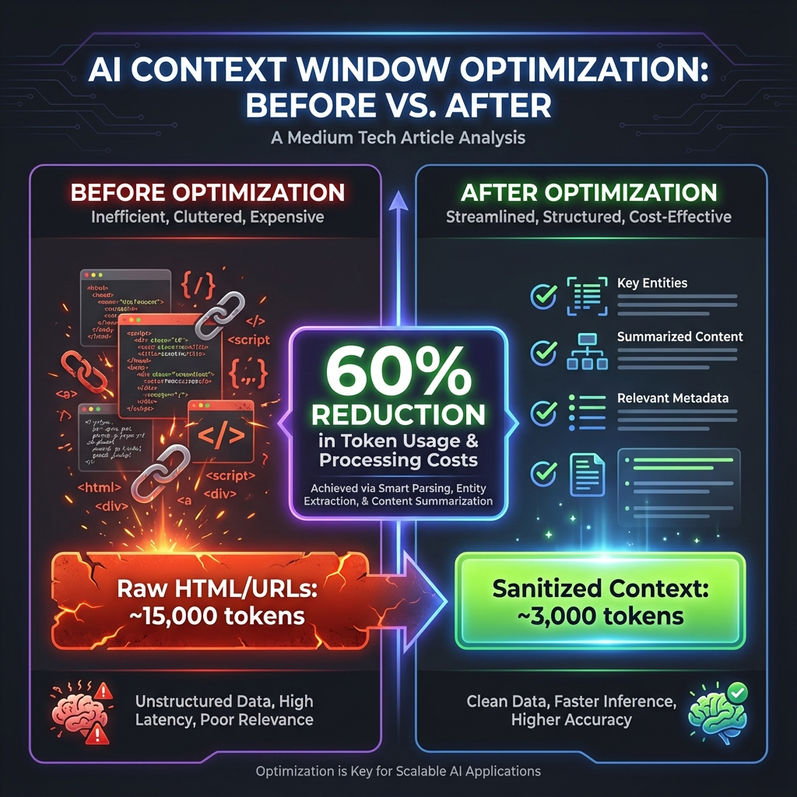
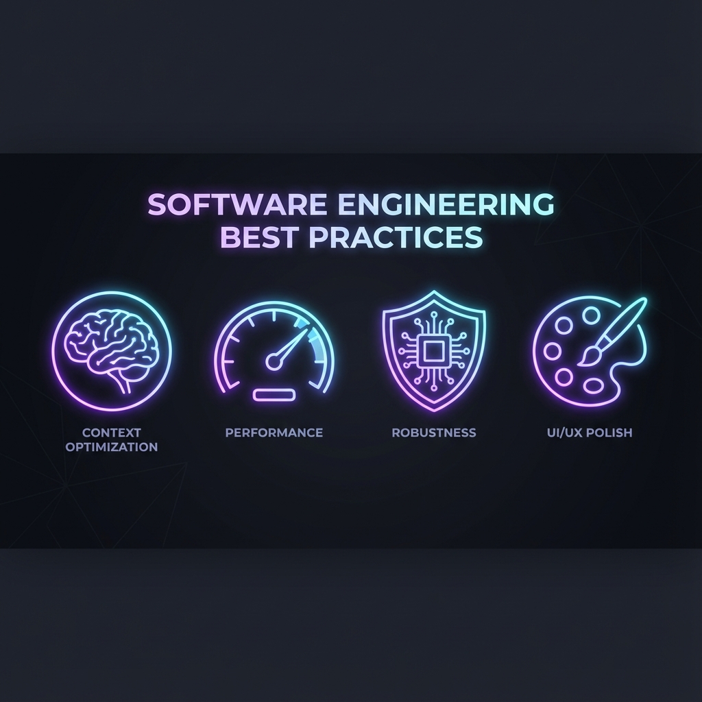

# I Built a Chrome Extension That Uses AI Without Sending Your Data to the Cloud — Here's What I Learned

## The rise of on-device AI is changing the privacy game. This is a developer's deep dive into Chrome's Gemini Nano.


---

**Key Takeaways:**
*   Chrome's built-in `window.ai` API (Gemini Nano) enables powerful AI features **100% locally on your device**.
*   Context window management is the #1 technical challenge for AI-native applications.
*   A reusable **"LLM-Ready Prompt"** can save you weeks of debugging.

**Technologies:** Chrome Extensions (Manifest V3), React, TypeScript, `window.ai` (Gemini Nano)

---

## The Problem I Wanted to Solve

We've all been there. You start your day with 3 tabs. By lunch, you have 47. Your browser becomes a graveyard of half-read articles, abandoned shopping carts, and That One Tab You Know Is Important But Can't Find.

This is **cognitive load**. It's not just messy; it actively harms your focus and productivity.

I wanted to build a tool that could:
1.  **Understand** what I was browsing.
2.  **Organize** my tabs into logical groups with a single click.
3.  **Protect my privacy** — no sending my browsing history to an external server.

The result was **MindTab**, an AI-powered tab manager. But the journey to get there was filled with hard-won lessons.

---

## Why On-Device AI? The Privacy Argument

The typical AI workflow looks like this:

`User Input → Send to Cloud API (OpenAI, Anthropic) → Receive Response`

This is fine for asking chatbots about recipes. But for a **browser extension** that has access to every page title, URL, and potentially page content you're viewing? That's a different story.

> Sending `["My Bank Account: Chase.com", "Job Application: Google Careers", "WebMD: Symptoms of..."]` to a third-party server is a non-starter for any privacy-conscious user.

**Enter Chrome's `window.ai` (Gemini Nano)**. This API provides access to a **small, efficient AI model that runs entirely within your browser**. The data never leaves your machine.

```javascript
// Initialize the on-device session
const session = await window.ai.languageModel.create({
  systemPrompt: "You are a helpful tab organizer..."
});

// The prompt and response stay LOCAL
const response = await session.prompt("Group these tabs: ...");
```

This architecture is a game-changer. It means I could build a tool that reads your tabs, understands context, and provides intelligent suggestions — all without ever needing network access for the AI core functionality.

---

## The #1 Challenge: LLM Context Optimization

Here's the dirty secret of building with LLMs: **garbage in, garbage out**.

The "context window" is the amount of text an LLM can process at once. Gemini Nano is powerful but resource-constrained compared to cloud giants. This forced me to be *ruthlessly efficient* with the data I sent to it.



### Mistake #1: Sending Raw HTML

My first attempt was to grab the full `document.body.innerHTML` of the active page. The result?

*   **15,000+ tokens** of `<div class="css-xyz123">`, scripts, and tracking pixels.
*   The LLM choked. Responses were slow, inaccurate, and hallucinated nonsense.

**The Fix: Aggressive Sanitization.**

I wrote a content extraction script that:
1.  Strips all `<script>`, `<style>`, and `<nav>` tags.
2.  Extracts only the main body text (using heuristics or `<article>` tags).
3.  Truncates to a maximum of 5,000 characters.

### Mistake #2: URL Clutter

A typical URL isn't just a clean path. It's littered with tracking parameters:

`/product/shoes?utm_source=facebook&utm_campaign=summer_sale&ref=affiliate123`

These tokens are *noise*. They eat up context and confuse the model about what's actually important.

**The Fix: URL Sanitization.**

```typescript
function sanitizeUrl(url: string): string {
  try {
    const parsed = new URL(url);
    // Return only the origin and pathname, stripping query params
    return `${parsed.origin}${parsed.pathname}`;
  } catch {
    return url;
  }
}
```

This single function reduced my average URL token count by **40%**.

### Mistake #3: Redundant Data Per Request

In a chat interface, users ask multiple questions. My initial implementation sent the *entire* list of open tabs with *every single message*. This was incredibly wasteful.

**The Fix: Hybrid Context Loading.**

*   **Full Content**: Only for the *currently active* tab (the one the user is looking at).
*   **Metadata Only**: For all other tabs, send only a `{title, url}` pair.
*   **State Diffing**: On subsequent turns, only send tabs that have *changed*.

**The Result:** Context size dropped by ~60%, latency improved dramatically, and the AI's accuracy actually *increased* because the signal-to-noise ratio was much better.

---

## The 4 Pillars of AI-Native App Development

Building MindTab taught me that success comes down to four key areas.



### 1. 🧠 Context Optimization
*   Never send raw DOM. Sanitize aggressively.
*   Strip URL query parameters.
*   Use a hybrid approach: full content for focus, metadata for context.

### 2. ⚡ Performance & State Management
*   In Chrome Extensions, the popup/side panel dies when closed. Persist critical state to `chrome.storage`.
*   Use optimistic UI updates: show the change *immediately*, let the API catch up in the background.
*   Offload heavy processing to Web Workers or the background script.

### 3. 🛡️ Robustness & Error Handling
*   `chrome.tabs.query({active: true})` can return `undefined`. Always have fallbacks.
*   The AI *will* generate invalid output sometimes (e.g., broken JSON, malformed Mermaid diagrams). Graceful error handling is not optional; it's essential.
*   Wrap API calls in try-catch and provide user-friendly fallback messages.

### 4. 🎨 UI/UX "Wow" Factor
*   Never ship "MVP aesthetics." In 2024+, users expect premium polish instantly. Use micro-animations, subtle glows, and glassmorphism.
*   Mask AI latency with beautiful loading states. Users forgive a 300ms delay if the animation is smooth.

---

## The "AI-Ready Project" Prompt: A Reusable Template

After going through this process, I distilled my learnings into a single, reusable prompt. Use this with **any AI coding assistant** (ChatGPT, Claude, Copilot, Cursor, you name it) to optimize a project for LLM efficiency.

> **Copy this prompt and adapt it to your project:**

---

```markdown
# AI-Ready Project Optimization Prompt

You are an expert AI/LLM Integration Architect. Your task is to analyze the
following project context and provide a comprehensive optimization plan.

## Project Context:
[Briefly describe your project, its tech stack, and its core AI features]

## Current Pain Points:
[List any issues you're facing: slow responses, inaccurate outputs, high token costs, etc.]

---

## Your Analysis Should Cover:

### 1. Context Window Optimization
- Identify all data sources being sent to the LLM (user input, page content, state).
- For EACH source, propose a concrete sanitization/truncation strategy.
- Goal: Reduce token count by at least 50% while preserving semantic meaning.
- Propose a "Hybrid Context" strategy: What gets full data vs. metadata only?

### 2. Structured Output Enforcement
- Review how LLM responses are currently parsed.
- Propose a JSON Schema or structured format for all AI outputs.
- Suggest error handling for malformed responses (e.g., fallback to raw text).

### 3. Application Performance
- Identify blocking operations on the main UI thread.
- Propose async patterns, worker threads, or caching strategies.
- For state management: What should be persisted vs. ephemeral?

### 4. Robustness Checklist
- Identify 3-5 edge cases where the AI or APIs could fail.
- For EACH, propose a graceful degradation / fallback mechanism.

### 5. UI/UX Polish
- Suggest micro-interactions to mask AI latency.
- Propose a design token system (CSS variables) for easy theming.

---

## Output Format:
Provide your response as a structured Markdown document with clear headings,
code snippets where applicable, and a prioritized action list.
```

---

## The Road Ahead: What's Next for On-Device AI?

Chrome's `window.ai` is still experimental (available in Canary/Dev channels), but it signals a major shift. Google, Apple, and Microsoft are all investing heavily in on-device models.

For developers, this means:

1.  **Privacy is becoming a feature, not a constraint.** You can now offer genuinely private AI features without sacrificing capability.
2.  **Edge computing is king.** Reducing round-trips to the cloud means faster, more responsive applications.
3.  **Context optimization is a core skill.** As models run on constrained hardware, your ability to manage input efficiently will be a key differentiator.

MindTab is just the beginning. I'm excited to see what the community builds as these tools mature.

---

## Key Resources

*   [Chrome Built-in AI Documentation](https://developer.chrome.com/docs/ai/built-in)
*   [MindTab on GitHub](https://github.com/csa7mdm/mindtab) *(Star if you found this helpful!)*
*   [Window.ai Explainer](https://github.com/nickswalker/window-ai)

---

**What challenges have you faced building with local LLMs? Drop a comment below — I'd love to hear your story.**

---

*Follow me for more deep dives into AI-native development, Chrome Extensions, and privacy-first engineering.*

---

**Tags:** `#AI` `#MachineLearning` `#ChromeExtension` `#Privacy` `#WebDevelopment` `#JavaScript` `#React` `#GeminiNano` `#OnDeviceAI` `#LLM` `#Programming` `#SoftwareEngineering`

---

## SEO Metadata (For Article Submission)

**Title:** I Built a Chrome Extension That Uses AI Without Sending Your Data to the Cloud — Here's What I Learned

**Subtitle:** The rise of on-device AI is changing the privacy game. This is a developer's deep dive into Chrome's Gemini Nano.

**Meta Description:** Learn how to build privacy-first AI applications using Chrome's on-device Gemini Nano. Includes lessons on context optimization, performance, and a reusable LLM prompt template.

**Keywords:** Chrome AI, Gemini Nano, on-device AI, window.ai, Chrome Extension development, LLM optimization, context window, privacy-first AI, local AI, edge computing, AI web development
