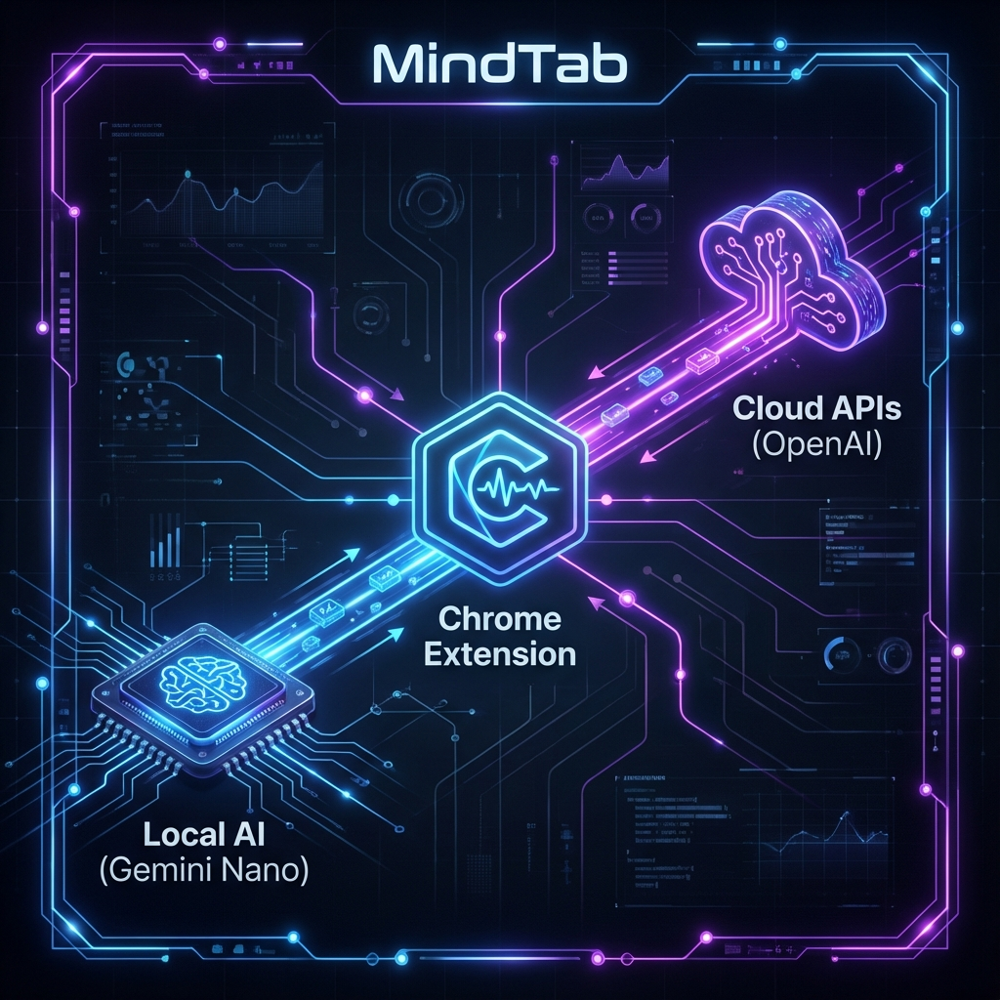

# MindTab: Reclaim Your Digital Sanity 🧠✨

> **"The Sanctuary for Your Focus."**

---

## 🌌 The Problem: Digital Chaos
You start with one tab. Then five. Then fifty.
Your browser becomes a cluttered mess of unread articles, half-finished tasks, and forgotten research.
**This is cognitive load**. It drains your battery, slows your computer, and—most importantly—scatters your focus.

## 🚀 The Solution: MindTab
MindTab isn't just a tab manager. It's an **intelligent workspace companion** that understands your browsing habits and organizes your digital life for you.

Using **Next-Gen On-Device AI (Gemini Nano)**, MindTab reads your tabs, understands context, and groups them into logical clusters—instantly.

### ✨ Premium Features
*   **🧠 AI-Powered Grouping**: One click to transform chaos into order. MindTab analyzes page titles and URLs to create meaningful groups like "Research," "Shopping," or "Dev Work."
*   **💬 Chat with Your Browser**: Ask questions like *"What was that article about React hooks I opened?"* or *"Summarize the flight options I'm looking at."* MindTab answers using the content of your active tabs.
*   **🔒 Privacy by Default**: No data leaves your machine. MindTab uses Chrome's built-in AI model, ensuring your browsing history stays yours.
*   **⚡ Zero-Latency Performance**: Optimized for speed. Group 100+ tabs in milliseconds without hogging memory.
*   **🔄 Auto-Updating Model List**: Fetches the latest free AI models from OpenRouter every 2 days, so you always have access to the best options.
*   **🎨 Cyber-Focus Aesthetics**: A stunning "Glass & Neon" interface designed for deep work. Features floating capsules, frosted glass panels, and a calming violet atmosphere.

---

## 🛠️ Installation (Beta v0.1.6)
MindTab is currently in **Beta**. Experience the future of browsing before anyone else.

### Option 1: Chrome Canary (Recommended for AI features)
To unlock the full power of on-device AI:
1.  Install [Chrome Canary](https://www.google.com/chrome/canary/).
2.  Enable Gemini Nano (See [Onboarding Guide](ONBOARDING.md)).
3.  Load the extension in Developer Mode.

### Option 2: Standard Installation
1.  Download the latest release.
2.  Go to `chrome://extensions`.
3.  Enable "Developer mode".
4.  Click "Load unpacked" and select the `dist` folder.

---

## 🔮 Roadmap
*   **v0.2**: Voice Commands & Multi-modal Input.
*   **v0.5**: Cross-device sync via P2P user encryption.
*   **v1.0**: Full Contextual Awareness & "Focus Mode" integration.

---

## 🤝 Contributing
We welcome visionaries. If you want to help shape the future of browser interaction:
1.  Fork the repo.
2.  Create your feature branch (`git checkout -b feature/AmazingFeature`).
3.  Commit your changes (`git commit -m 'Add AmazingFeature'`).
4.  Push to the branch.
5.  Open a Pull Request.

---

**MindTab**. *Focus on what matters. Let AI handle the rest.*
